# Attack and Detect Lab

## Overview

This project simulates real cyber attacks against a Windows 10 endpoint in my home lab and demonstrates detection using Wazuh SIEM. I acted as both attacker (Kali Linux) and defender (Wazuh), mapping every attack to the MITRE ATT&CK framework.

The lab covers the full attack lifecycle — from reconnaissance through exploitation — and shows exactly how a SIEM detects, alerts, and correlates each stage in real time.

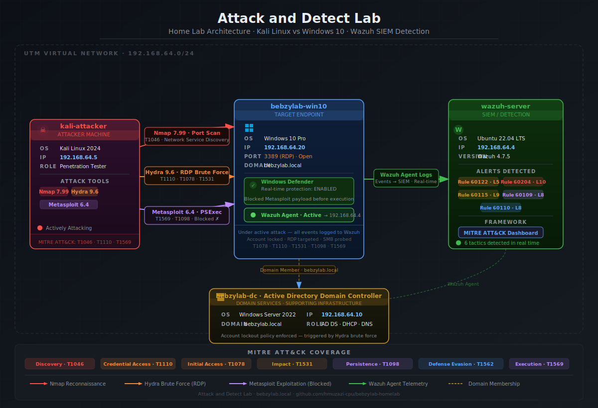

---

## Lab Architecture

| VM | OS | IP Address | Role |
|----|-----|------------|------|
| kali-attacker | Kali Linux 2024 | 192.168.64.5 | Attacker machine |
| wazuh-server | Ubuntu 22.04 LTS | 192.168.64.4 | Wazuh SIEM (Manager · Indexer · Dashboard) |
| bebzylab-win10 | Windows 10 Pro | 192.168.64.20 | Target endpoint |
| bebzylab-dc | Windows Server 2022 | 192.168.64.10 | Active Directory Domain Controller |

All VMs run on UTM on a Late 2015 iMac via a shared internal network (192.168.64.0/24).

---

## Tools Used

| Tool | Version | Purpose |
|------|---------|---------|
| Kali Linux | 2024 | Attacker OS |
| Nmap | 7.99 | Port scanning and OS detection |
| Hydra | 9.6 | RDP brute force |
| Metasploit | 6.4 | Exploitation framework |
| Wazuh | 4.7.5 | SIEM — detection, alerting, and correlation |
| Windows Defender | Built-in | Endpoint protection |
| MITRE ATT&CK | Framework | Attack classification and mapping |

---

## Attack 1 — Reconnaissance (Nmap)

**Command:** `nmap -sV -O 192.168.64.20`

Performed an OS and service version detection scan against the Windows 10 target. Nmap identified port 3389 (RDP) as open and detected the OS as Windows 10 with 92% confidence. This reconnaissance phase directly informed the brute force attack that followed.

**Key findings:**
- Port 3389/tcp open — Remote Desktop Protocol
- OS detected: Windows 10 (92% confidence)
- Service: Microsoft Terminal Services

**MITRE ATT&CK:** T1046 — Network Service Discovery

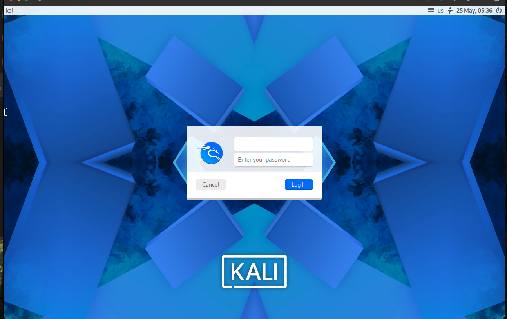

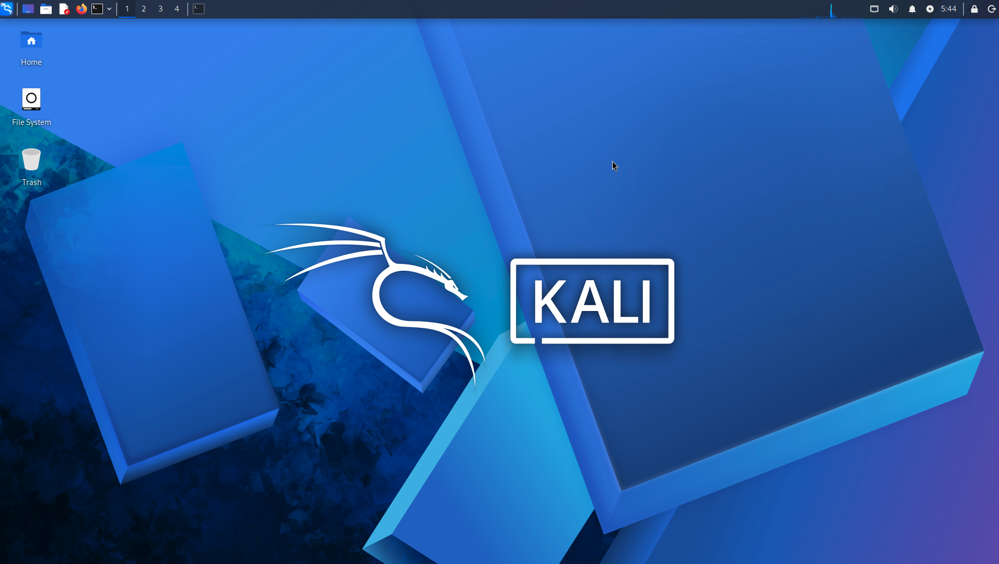

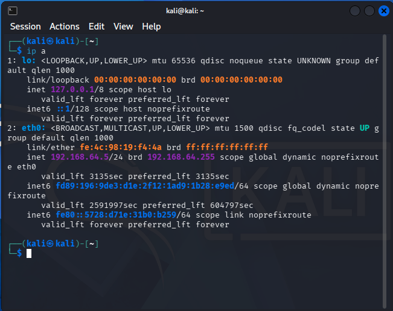

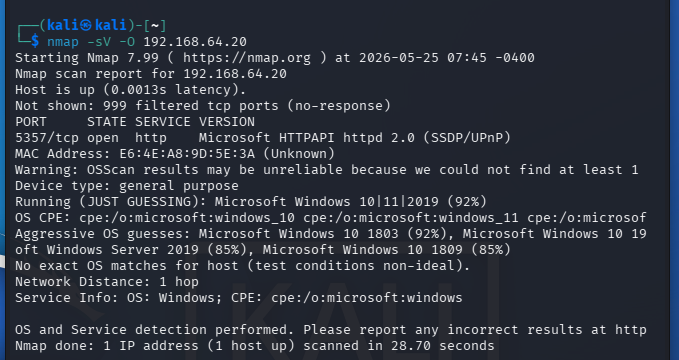

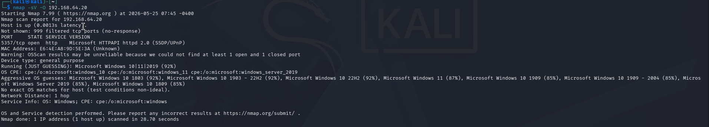

---

## Attack 2 — Brute Force (Hydra)

**Tool:** Hydra 9.6  
**Target:** `rdp://192.168.64.20` — administrator account

Launched an RDP brute force attack using Hydra against the Windows 10 machine's administrator account. The Windows account lockout policy (enforced via Group Policy from the domain controller) triggered after repeated failures.

**Wazuh alerts triggered:**

| Rule | Description | Severity |
|------|-------------|----------|
| 60122 | Multiple Windows logon failures | Level 5 |
| 60204 | Multiple authentication failures | Level 10 |
| 60115 | Windows account locked out | Level 9 |

**MITRE ATT&CK:**
- T1110 — Brute Force
- T1078 — Valid Accounts
- T1531 — Account Access Removal

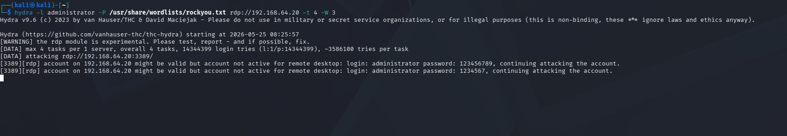

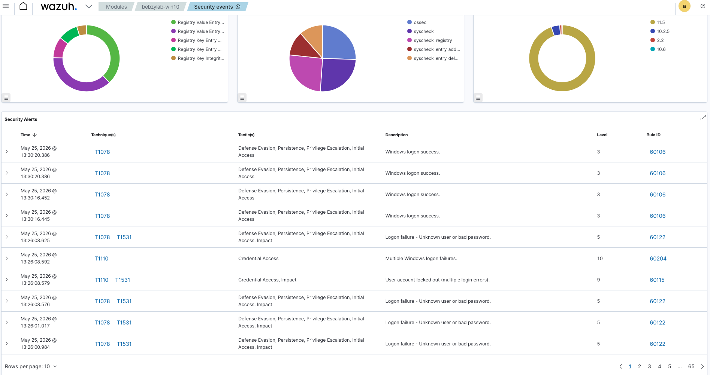

---

## Attack 3 — Exploitation Attempt (Metasploit)

**Module:** `exploit/windows/smb/psexec`  
**Target:** `192.168.64.20` over SMB

Attempted remote code execution using Metasploit's psexec module over SMB. Windows Defender detected and blocked the payload before it could execute on the target. Wazuh still logged the authentication attempts and account manipulation events, showing that the SIEM captured the attack even when the endpoint defender intervened first.

**Wazuh alerts triggered:**

| Rule | Description | Severity |
|------|-------------|----------|
| 60109 | Windows account manipulation | Level 8 |
| 60110 | Windows account change | Level 8 |

**MITRE ATT&CK:**
- T1569 — System Services (Service Execution)
- T1098 — Account Manipulation

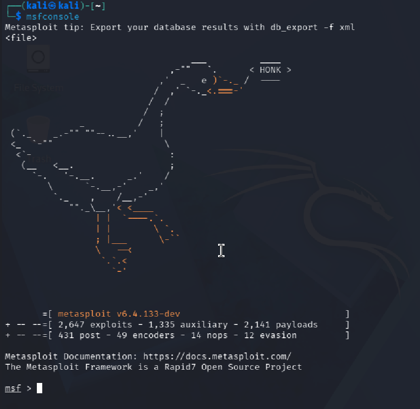

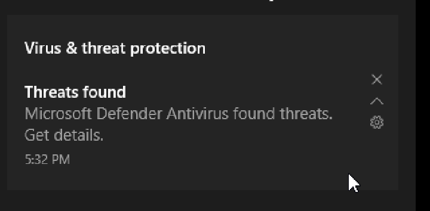

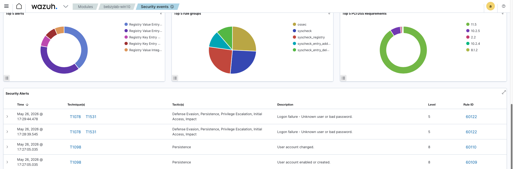

---

## MITRE ATT&CK Summary

| Tactic | Technique | Tool Used | Wazuh Rule | Severity |
|--------|-----------|-----------|------------|----------|
| Discovery | T1046 — Network Service Discovery | Nmap | N/A | N/A |
| Initial Access | T1078 — Valid Accounts | Hydra | 60122 | Level 5 |
| Credential Access | T1110 — Brute Force | Hydra | 60204 | Level 10 |
| Impact | T1531 — Account Access Removal | Hydra | 60115 | Level 9 |
| Persistence | T1098 — Account Manipulation | Metasploit | 60109 | Level 8 |
| Defense Evasion | T1562 — Impair Defenses | Metasploit | 60110 | Level 8 |

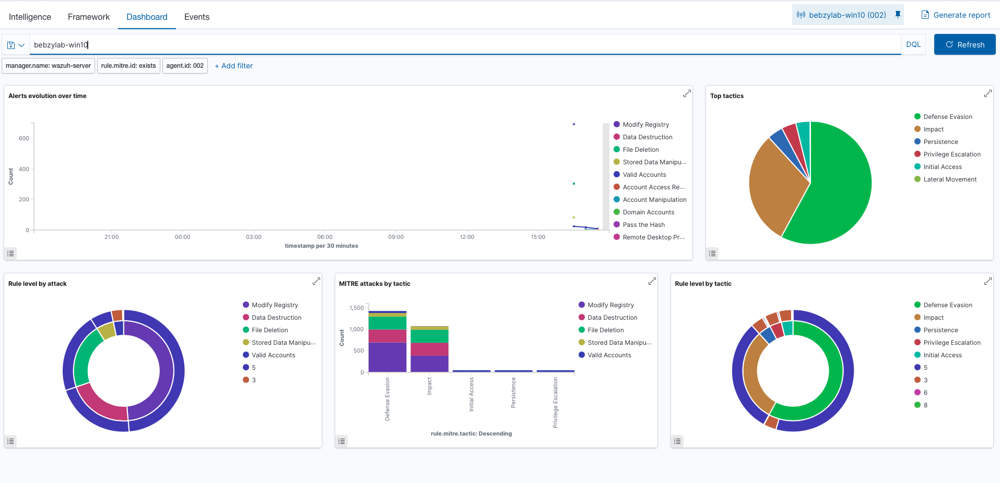

---

## Key Findings

- **Account lockout triggered after brute force** — Windows security policy working as intended; GPO from the domain controller locked the account after repeated failures
- **Windows Defender blocked Metasploit payload before execution** — The endpoint stopped the payload at the detection stage, demonstrating defence in depth
- **Wazuh correlated all attack stages in real time** — Every phase from reconnaissance through exploitation was captured and alerted
- **MITRE ATT&CK dashboard showed 6 distinct tactics detected** — Discovery, Initial Access, Credential Access, Impact, Persistence, and Defense Evasion all mapped

---

## Key Skills Demonstrated

- Offensive security tools (Nmap, Hydra, Metasploit)
- SIEM alert analysis and correlation
- MITRE ATT&CK framework mapping
- Attacker vs defender perspective (red team / blue team)
- Windows endpoint security and Group Policy enforcement

---

## Certifications

- CompTIA A+
- CompTIA Security+
- CompTIA Network+
- Microsoft AZ-900 *(in progress)*

---

## Related Projects

- [Active Directory Lab](../active-directory-lab)
- [Wazuh SIEM Lab](../wazuh-siem-lab)

---

## GitHub

[github.com/hmuzazi-cpu/bebzylab-homelab](https://github.com/hmuzazi-cpu/bebzylab-homelab)
