# Project 4 — Cisco Networking Lab (GNS3)

## Overview

This project builds and operates a multi-site enterprise network entirely inside GNS3 using real Cisco IOS images. The lab simulates three geographically separate locations — HQ, Branch, and Data Centre — connected by serial WAN links, running OSPF for dynamic routing, with VLANs, inter-VLAN routing, and an ACL enforcing network segmentation policy.

Traffic was captured live in Wireshark to validate protocol behaviour and confirm that OSPF neighbour relationships formed correctly across the WAN.

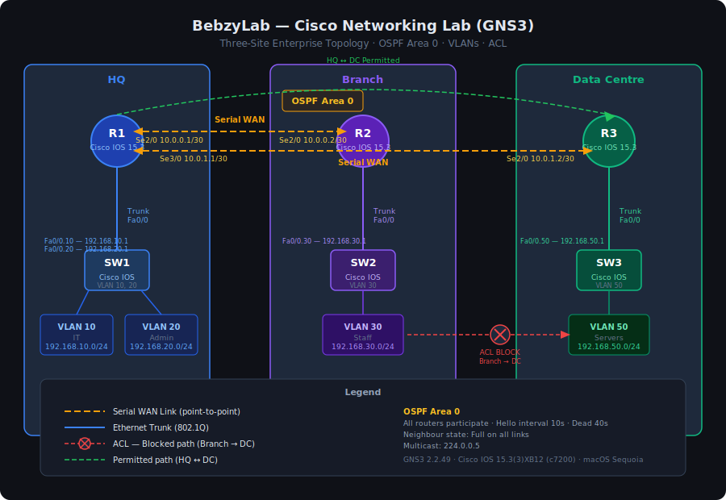

---

## Objectives

- Deploy a three-site routed network using Cisco IOS 15.x in GNS3
- Configure OSPF Area 0 across all three sites for dynamic routing
- Implement VLANs and inter-VLAN routing via router-on-a-stick subinterfaces
- Enforce network policy using a named ACL blocking Branch from reaching the Data Centre
- Capture and analyse live OSPF traffic with Wireshark

---

## Tools Used

| Tool | Version | Purpose |
|------|---------|---------|
| GNS3 | 2.2.49 | Network emulation platform |
| Cisco IOS | 15.3(3)XB12 (c7200) | Router operating system |
| Wireshark | Latest | Live packet capture and protocol analysis |
| macOS Sequoia | 15.x | Host operating system |

---

## Topology

### Three-Site Architecture

| Site | Devices | VLANs |
|------|---------|-------|
| HQ | R1, SW1 | VLAN 10 (IT), VLAN 20 (Admin) |
| Branch | R2, SW2 | VLAN 30 (Staff) |
| Data Centre | R3, SW3 | VLAN 50 (Servers) |

WAN links are serial point-to-point connections between R1↔R2 and R1↔R3. R1 acts as the hub, with R2 and R3 as spokes.

---

## IP Addressing Table

### WAN Links (Serial)

| Link | Interface | IP Address | Subnet |
|------|-----------|-----------|--------|
| R1 → R2 | R1 Se2/0 | 10.0.0.1 | /30 |
| R1 → R2 | R2 Se2/0 | 10.0.0.2 | /30 |
| R1 → R3 | R1 Se3/0 | 10.0.1.1 | /30 |
| R1 → R3 | R3 Se2/0 | 10.0.1.2 | /30 |

### HQ — R1 Subinterfaces (Inter-VLAN Routing)

| Subinterface | VLAN | IP Address | Subnet | Network |
|-------------|------|-----------|--------|---------|
| R1 Fa0/0.10 | 10 | 192.168.10.1 | /24 | IT |
| R1 Fa0/0.20 | 20 | 192.168.20.1 | /24 | Admin |

### Branch — R2 Subinterfaces

| Subinterface | VLAN | IP Address | Subnet | Network |
|-------------|------|-----------|--------|---------|
| R2 Fa0/0.30 | 30 | 192.168.30.1 | /24 | Staff |

### Data Centre — R3 Subinterfaces

| Subinterface | VLAN | IP Address | Subnet | Network |
|-------------|------|-----------|--------|---------|
| R3 Fa0/0.50 | 50 | 192.168.50.1 | /24 | Servers |

---

## Configuration Summary

### 1. Hostnames and Base Configuration

Each router was assigned a hostname matching its role (`R1`, `R2`, `R3`). Interfaces were brought up with `no shutdown` and verified using `show ip interface brief`.

### 2. IP Addressing

All router interfaces — serial WAN links and FastEthernet subinterfaces — were assigned static IP addresses as per the addressing table above. Encapsulation was set to `dot1q` on each subinterface for 802.1Q VLAN tagging.

### 3. OSPF Area 0

OSPF process 1 was configured on all three routers with all directly connected networks advertised into Area 0. After convergence, `show ip ospf neighbor` confirmed full adjacency across both WAN links (R1↔R2 and R1↔R3).

```
router ospf 1
 network 10.0.0.0 0.0.0.3 area 0
 network 10.0.1.0 0.0.0.3 area 0
 network 192.168.10.0 0.0.0.255 area 0
 network 192.168.20.0 0.0.0.255 area 0
```

### 4. VLANs

VLANs were created on each switch using `vlan database` mode:
- SW1: VLAN 10 (IT), VLAN 20 (Admin)
- SW2: VLAN 30 (Staff)
- SW3: VLAN 50 (Servers)

Switch ports were configured as access ports assigned to the appropriate VLAN, and the uplink to the router was set as a trunk (`switchport mode trunk`).

### 5. Inter-VLAN Routing (Router-on-a-Stick)

Each router's FastEthernet interface was configured with subinterfaces, one per VLAN. Each subinterface carries `encapsulation dot1q <vlan-id>` and an IP address in the VLAN subnet — this is the default gateway for hosts in that VLAN.

### 6. ACL — Block Branch from Data Centre

A named extended ACL was applied to R2 to prevent Branch (VLAN 30, 192.168.30.0/24) from reaching the Data Centre (VLAN 50, 192.168.50.0/24), while still permitting traffic to HQ.

```
ip access-list extended BLOCK-BRANCH-TO-DC
 deny ip 192.168.30.0 0.0.0.255 192.168.50.0 0.0.0.255
 permit ip any any
```

Applied outbound on R2's serial interface toward R1. Verified by pinging from Branch to DC (dropped) and from HQ to DC (permitted).

---

## Wireshark Analysis

### OSPF Hello Packets

Wireshark was used to capture traffic on the serial link between R1 and R2. Filtering on `ospf` revealed:

| Field | Value |
|-------|-------|
| Protocol | OSPF v2 |
| Packet type | Hello |
| Hello interval | 10 seconds |
| Dead interval | 40 seconds |
| Area ID | 0.0.0.0 (Area 0) |
| Router ID (R1) | 10.0.0.1 |
| Router ID (R2) | 10.0.0.2 |
| Neighbour state | Full |

OSPF Hello packets were multicast to `224.0.0.5` every 10 seconds, maintaining neighbour adjacency between R1 and R2. The captured packets confirmed that the dead interval (40 seconds) was four times the hello interval, matching Cisco IOS defaults.

A deep dive into a single Hello packet confirmed the OSPF header, authentication type (null), and the active neighbour list — validating that both sides had moved to the **Full** state.

---

## Screenshots

### GNS3 Setup

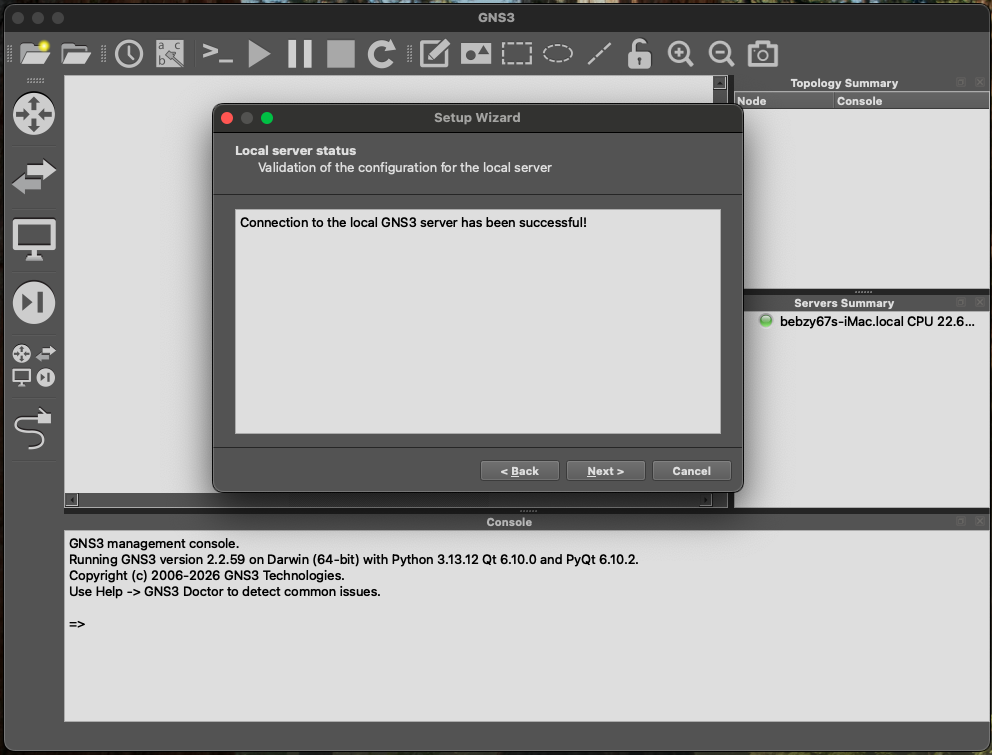

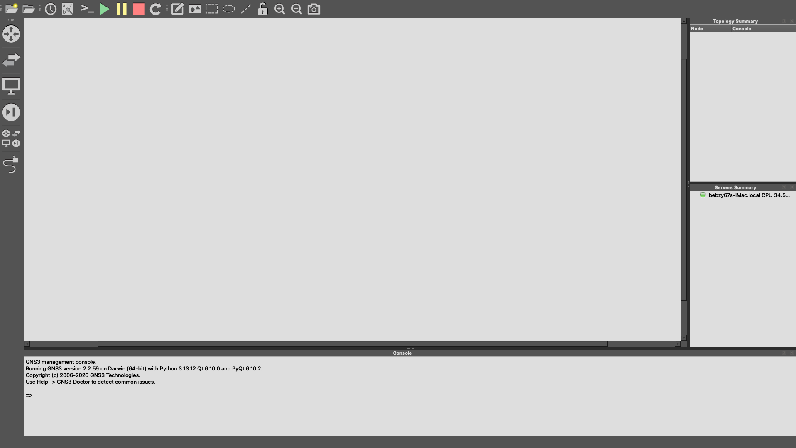

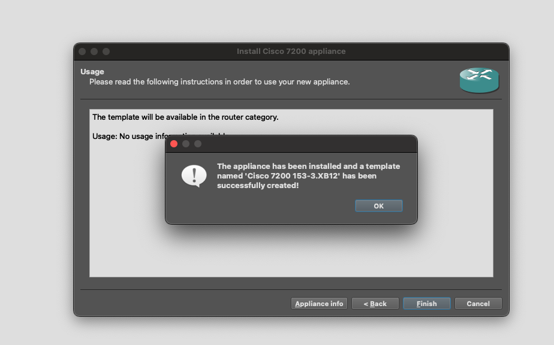

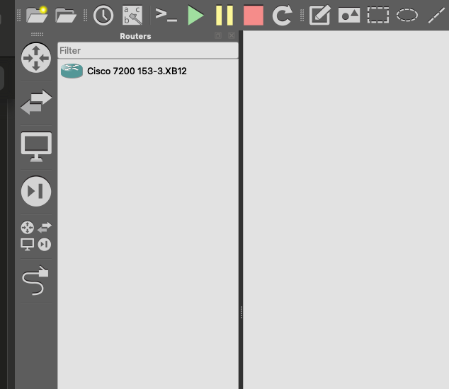

### Topology Build

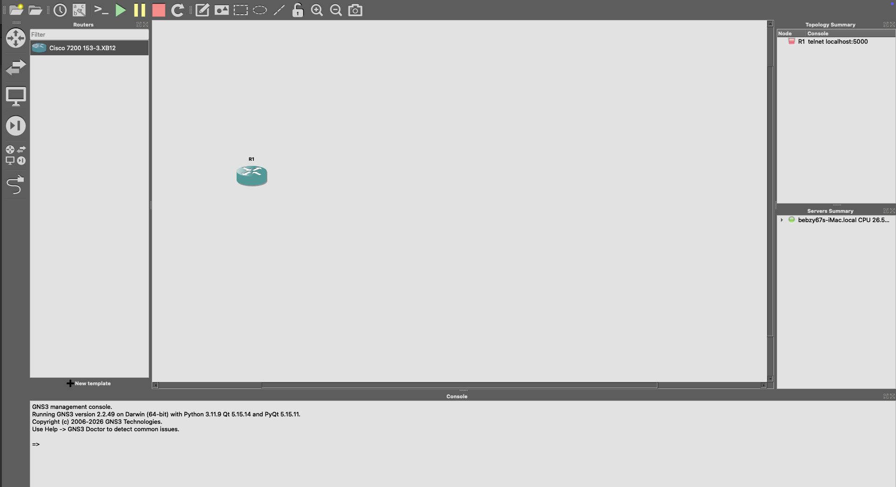

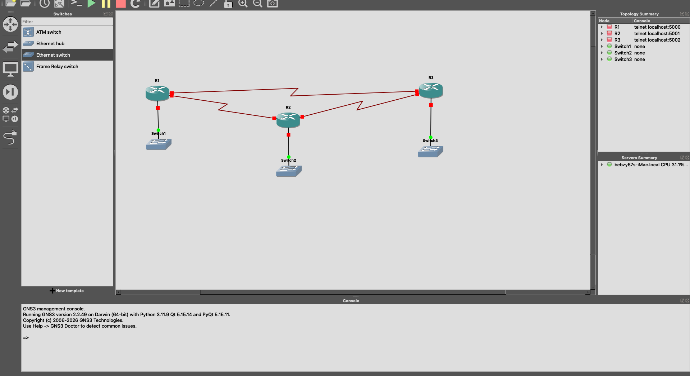

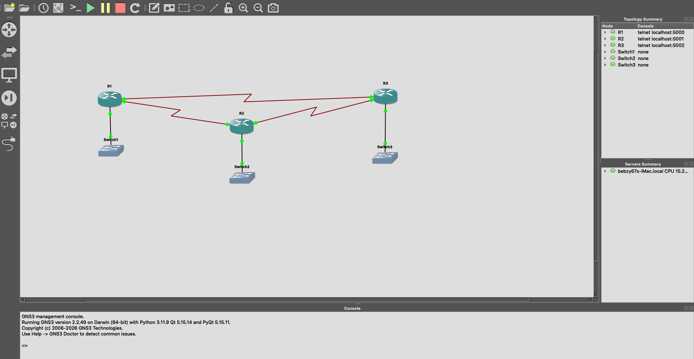

### IP Addressing & WAN Links

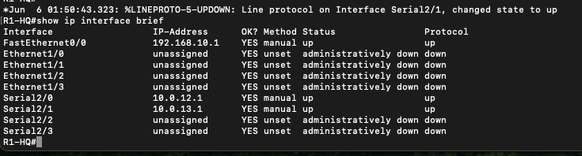

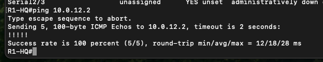

### OSPF

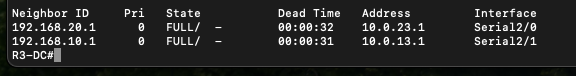

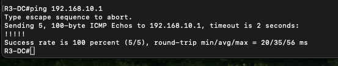

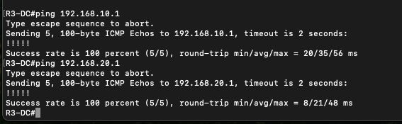

### VLANs & Inter-VLAN Routing

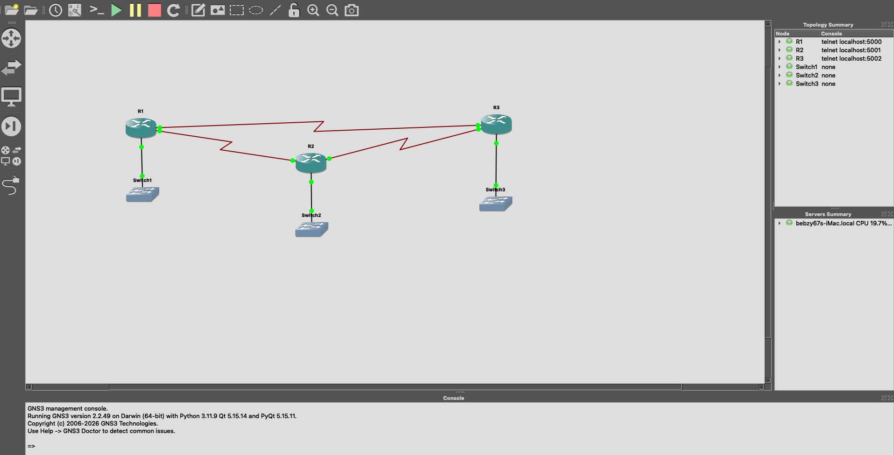

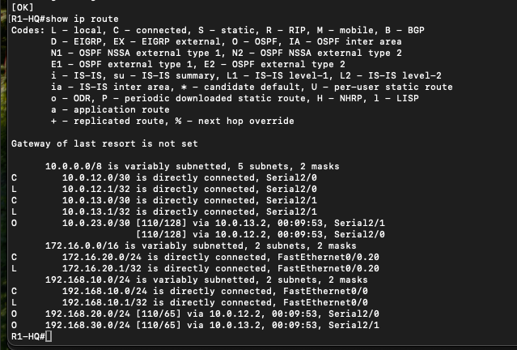

### ACL

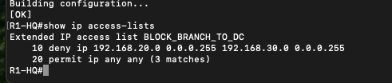

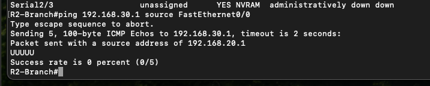

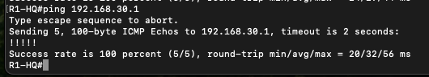

### Wireshark

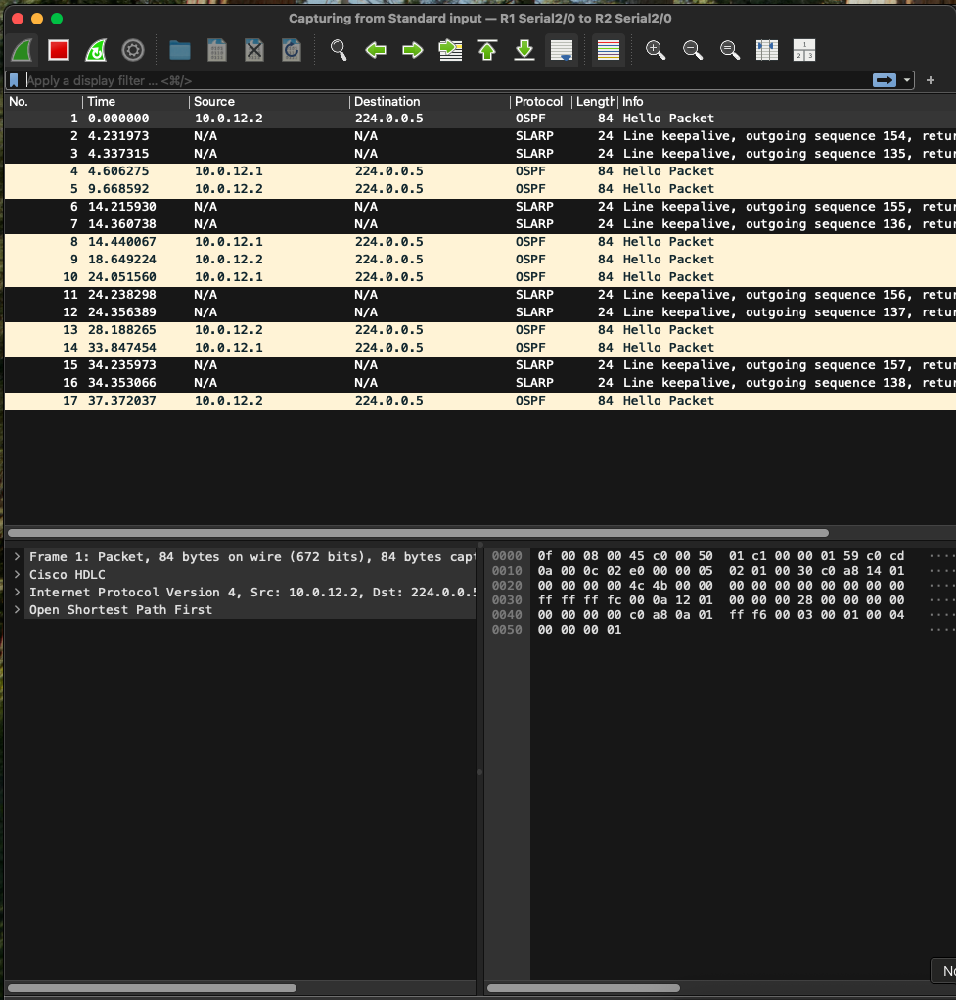

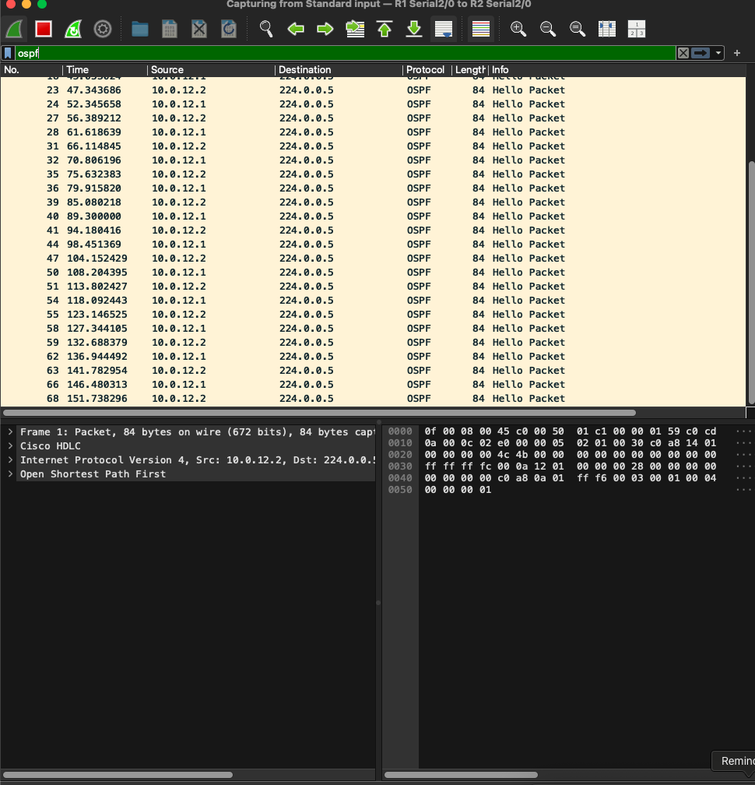

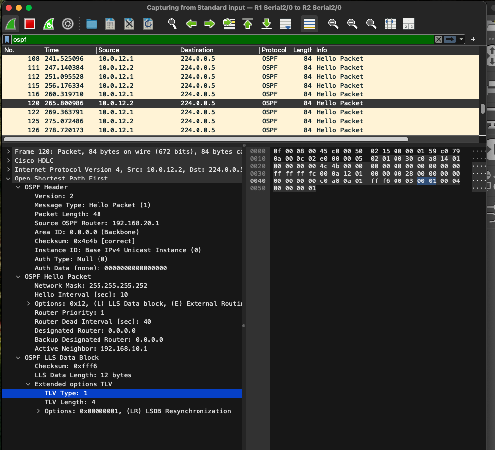

---

## Skills Demonstrated

### IT Support Relevance

| Skill | Application |
|-------|-------------|
| IP addressing and subnetting | Assigned addresses across four subnets per site; no overlap, correct masks |
| VLAN configuration | Created and assigned VLANs on Cisco switches; configured trunk and access ports |
| Default gateway concepts | Each VLAN subnet points to the router subinterface as its gateway |
| Network troubleshooting | Used `show ip interface brief`, `show ip route`, `ping`, and `traceroute` to verify end-to-end connectivity |
| CLI familiarity (Cisco IOS) | Navigated privileged exec, global config, interface config modes fluently |

### SOC / Security Relevance

| Skill | Application |
|-------|-------------|
| Network segmentation | VLANs isolate traffic by function; ACL enforces a deny rule between Branch and DC |
| Access control lists | Named extended ACL applied directionally; blocks a specific source/destination pair while permitting all other traffic |
| Packet capture and analysis | Wireshark used to verify protocol behaviour and confirm no unexpected traffic crossing segment boundaries |
| OSPF understanding | Recognising OSPF Hello floods in a capture is a core skill for distinguishing normal routing traffic from anomalies |
| Traffic flow validation | Confirmed that the ACL drops Branch→DC traffic without affecting other paths — essential for firewall rule validation |

---

## Why This Matters

Enterprise networks are not flat. Every organisation of any size uses VLANs to segment traffic, dynamic routing protocols like OSPF to propagate reachability, and ACLs or firewall rules to enforce policy between segments.

This lab replicates exactly that pattern:
- **VLANs** mirror how real networks separate HR, Finance, IT, and Server traffic at Layer 2
- **OSPF** is the IGP running inside most enterprise and campus networks today
- **Router-on-a-stick** is the standard inter-VLAN routing method when a dedicated Layer 3 switch is not in use
- **Named ACLs** are the Cisco equivalent of firewall rules — this lab enforces a zero-trust-style policy where Branch staff have no path to the Data Centre by default

For an IT support or junior networking role, understanding how a packet travels from a VLAN on a branch switch, through a trunk to the router, across a serial WAN link, through OSPF-learned routes, and is then dropped by an ACL — is the foundation of network troubleshooting. For a SOC analyst, understanding this topology is what separates expected traffic from an anomaly worth investigating.

---

## Certifications

- CompTIA A+ ✓
- CompTIA Security+ ✓
- CompTIA Network+ ✓
- Microsoft AZ-900 *(in progress)*

---

## Related Projects

- [Active Directory Lab](../README.md)
- [Wazuh SIEM Lab](../wazuh-siem-lab)
- [Attack and Detect Lab](../attack-detect-lab)

---

## GitHub

[github.com/hmuzazi-cpu/bebzylab-homelab](https://github.com/hmuzazi-cpu/bebzylab-homelab)
